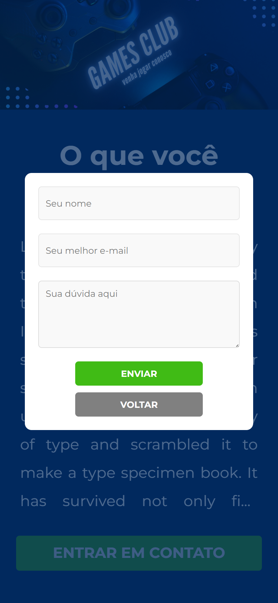

# Games Club

Projeto desenvolvido em HTML,CSS e Java Script na semana Você Programador do Rodolfo Mori. O site desenvolvido é dinâmico, permite envio de formulário para o e-mail selecionado.

🔗 [Click here to access](https://n4ju15.github.io/games-club/)

## Versão para Desktop

### Versão para Mobile

## Tecnologias

- HTML
- CSS
- Git and Github
